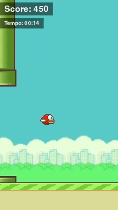

# Flap Bird Game

Um jogo estilo Flap Bird desenvolvido em Python.



## Requisitos

- Python 3.13.3 +
- Pygame 2.6.1 +
- SQLite

## Instalação

1. Clone o repositório:

```bash
git clone https://github.com/estevan-ulian/flap-bird.git
cd flap-bird
```

2. Crie e ative um ambiente virtual:

```bash
# Criando o ambiente virtual
python -m venv .venv
```

```bash
# ATIVANDO O AMBIENTE VIRTUAL

# LINUX/MAC
source .venv/bin/activate

# WINDOWS
.venv\Scripts\activate
```

2. Instale as dependências:

```bash
pip install -r requirements.txt
```

## Como Jogar

Execute o jogo:

```bash
python main.py
```

### Controles

- **Barra de Espaço**: pressione para começar o jogo e para fazer o pássaro voar

### Objetivo

Passe pelos canos sem colidir para marcar pontos.

- A cada grupo de canos ultrapassado, o jogador ganha 50 pontos.
- A cada 5 segundos sem colidir, o jogador ganha 25 pontos.

Tente bater seu recorde!

## Estrutura do Projeto

```
├── main.py          # Arquivo principal
├── src/             # Código fonte
│   ├── game.py      # Lógica principal do jogo
│   ├── bird.py      # Classe do pássaro
│   ├── pipe.py      # Classe dos canos
│   ├── ground.py    # Classe do chão
│   ├── score.py     # Sistema de pontuação
|   ├── constants.py # Constantes do jogo
|   └── dbproxy.py   # Gerenciamento de banco de dados
└── assets/          # Recursos do jogo
    ├── sprites/     # Imagens
    └── audio/       # Sons
```

## Tecnologias Utilizadas

- Python
- Pygame
- SQLite
- cx_Freeze
